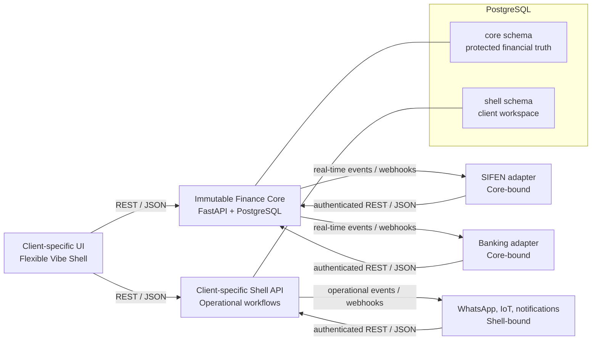

# VibeCore ERP

> **A composable, AI-first ERP foundation for SMEs — built around the way a business actually works.**

VibeCore ERP is the architectural standard behind fast, durable, client-specific ERP systems. It separates the financial truth of a business from the interfaces, automations, and integrations built around it.

Instead of repeatedly rebuilding generic CRUD applications, teams define dependable data models and workflows once. AI agents then assemble the client-specific shell and integrations around a protected accounting core.

**Core principle:** the business process shapes the software — never the other way around.

> Accepted ADRs and `AGENTS.md` are binding. They take precedence if this README
> ever conflicts with them.

## Why VibeCore?

Traditional ERPs force every company into the same screens, modules, and processes. VibeCore takes the opposite approach:

- **Finance stays reliable.** Double-entry accounting, tax logic, and financial
  integrity live in one protected core.
- **The client experience stays flexible.** Each business gets a shell that
  matches its real operations: a scale at a gold buyer, a counter at a store,
  or a mobile workflow in the field.
- **Integrations stay replaceable.** WhatsApp, e-invoicing, banking, OCR, and
  future services run outside the core as isolated adapters.
- **AI accelerates delivery without gaining financial authority.** AI can create
  workflows and draft transactions; a human approves financial execution.

VibeCore is designed for micro, small, and medium-sized enterprises (MSMEs), especially teams that need bespoke operational software without bespoke financial foundations every time.

## Architecture at a glance



| Layer | Responsibility | Freedom to change |
| --- | --- | --- |
| **Finance Core** (`/backend`) | Accounting, items, taxes, transaction integrity | Protected |
| **Shell workspace** (`shell` schema) | Client-specific processes, data, and UI | Extensible |
| **Adapters** | External services and provider-specific logic | Isolated and replaceable |
| **Vibe Shell** (`/frontend`) | Task-focused client interface | Fully open; choose the suitable stack |

## The two-tier standard

### VibeCore ERP — the global standard

The global architecture is deliberately portable:

- **Headless by design.** The Finance Core owns no user interface.
- **Process proximity.** Client workflows determine the Shell experience;
  standard ERP screens do not.
- **Prompt as code.** Define the model and contracts clearly; let AI generate
  the repetitive integration work.
- **Modern, minimal foundation.** The Core uses raw Python with FastAPI and
  PostgreSQL — no legacy ERP framework.

### VibeCore PY — the Paraguayan implementation

VibeCore-PY applies the global standard to Paraguay. Implementations in this context must:

- Use the Paraguayan Chart of Accounts under **Ley 6380/19**.
- Validate **RUC** values, including the check digit (**DV**).
- Prioritize a **SIFEN / e-Kuatia** adapter for electronic invoices.
- Support **Marangatú** export formats, including **RG 90** requirements.
- Model the three IVA treatments for every applicable financial transaction:
  **exempt, 5%, and 10%**.

> Compliance is a product requirement, not an adapter detail. Local tax and
> e-invoicing rules must be independently reviewed and kept current before
> production use.

## Layer A — Immutable Finance Core

The Finance Core is one monolithic service and database boundary, chosen intentionally for ACID-safe financial transactions.

**Required stack:** Python, FastAPI, PostgreSQL.

The `core` PostgreSQL schema is limited to the durable financial domain:

- Double-entry accounting
- Items and financial master data
- Tax calculation and classification
- Financial transaction state

### Core invariants

1. **AI agents must not modify the `core` schema.**
2. Financial records must preserve balanced, auditable double-entry semantics.
3. Every financial action records an `actor`, such as `HUMAN_CARLOS`,
   `SYSTEM_CRON`, or `AI_AGENT`.
4. A transaction drafted or initiated by AI remains `DRAFT` until a human
   approves it through the Shell.
5. Core changes require explicit architecture-owner approval and a reviewed
   migration path.

The Core is intentionally small. It should know financial truth, not the peculiarities of an individual client’s operational workflow.

## The Shell workspace

The `shell` PostgreSQL schema is where a client’s actual business lives.

It may contain client-specific tables, views, and workflows — for example scale readings for a precious-metals buyer, delivery routes, service orders, or shop-floor data. Shell tables may reference Core primary keys through foreign keys, but must not redefine or bypass financial rules.

Every Shell schema change requires a deterministic Alembic migration. Migrations must be reproducible, reviewed, and safe to apply in a clean environment.

## Layer B — Adapters: Core-bound and Shell-bound

Adapters connect VibeCore to the outside world. They run as independent Dockerized microservices and are free to use the language and runtime that best suits the provider: Node.js, Go, Python, or another appropriate stack.

### Adapter topology

- **Core-bound adapters** — for example SIFEN and Banking — integrate with the
  Finance Core’s authenticated API and event boundary to handle compliance,
  invoices, and accounting triggers.
- **Shell-bound adapters** — for example WhatsApp, operational notifications,
  and IoT scale feeds — integrate with client-specific Shell workflows through
  authenticated Shell APIs and events.

### Adapter contract

- Communicate with the Core or Shell exclusively through versioned **JSON over
  authenticated REST APIs and events**.
- **Never connect directly to PostgreSQL.** Database isolation is absolute for
  both Core-bound and Shell-bound adapters.
- Expose an `openapi.json` specification.
- Include an AI-readable contract at `.ai/adapter_schema.md`.
- Include a `/blueprints` directory when the adapter needs reusable
  user-interface components, such as an OCR camera flow.
- Treat provider credentials, signing keys, and secrets as runtime
  configuration — never commit them.

### Real-time first, recovery second

Critical business actions must use real-time Core-to-Adapter or
Shell-to-Adapter events and webhooks. For example, a POS checkout that needs a
SIFEN e-invoice triggers the SIFEN adapter immediately.

An adapter may poll the relevant API only for recovery, such as reconciling
missed work after startup. Polling is **not** a substitute for a real-time
business workflow.

## Layer C — Flexible Vibe Shell frontend

The Vibe Shell is the client-facing layer. Vue or React with Tailwind CSS is a
common reference stack for web interfaces, but the architecture is fully open:
build the Shell with any framework or stack — such as Streamlit, custom Python
frontends, or native apps — that fits the workflow.

The Shell owns workflow design, visual identity, and task-specific interaction. It should make the client’s daily work feel native, while the Finance Core remains invisible and dependable underneath.

For complex integrations, adapter repositories should ship generic frontend
blueprints in `/blueprints`. AI agents can copy these components into the Shell
and tailor their styling and placement without reimplementing the integration
contract.

## Data, API, and MCP conventions

### Design for the next unknown requirement

Every JSON payload exchanged among the Core, Shell, and Adapters must provide
optional extension objects:

```json
{
  "id": "txn_01J...",
  "status": "DRAFT",
  "meta": {},
  "custom_data": {}
}
```

Use `meta` for interoperable technical or integration metadata. Use
`custom_data` for domain-specific extensions. Consumers must tolerate fields
they do not recognize. This keeps contracts forward-compatible without breaking
older clients.

### State, traceability, and Model Context Protocol (MCP)

- Record the actor responsible for every financial action.
- Preserve approval history and audit context.
- Model AI-originated financial work as `DRAFT` until human approval.
- Prefer explicit, idempotent API operations for event retries and recovery.
- **MCP integration:** AI developer agents interact through Model Context
  Protocol (MCP) servers that expose safe tools and resources. MCP servers use
  the same authenticated API boundaries as other integrations; they never
  receive direct database credentials and must preserve immutable Core barriers.

## Repository conventions

As modules are added, follow this structure:

```text
.
├── backend/                 # FastAPI Finance Core and Shell services
│   ├── core/                # Protected financial domain
│   └── shell/               # Client-specific workspace domain
├── frontend/                # Flexible Vibe Shell (choice of stack)
├── adapters/                # Isolated Core-bound and Shell-bound services
│   └── <adapter>/
│       ├── .ai/adapter_schema.md
│       ├── blueprints/      # Optional reusable UI components
│       └── openapi.json
├── migrations/              # Deterministic Alembic migrations
└── docs/                    # Architecture decisions and operating guides
```

## Instructions for AI agents and contributors

Before implementing a feature, identify its layer.

| If you need to… | Build it in… |
| --- | --- |
| Post a journal entry, calculate tax, or enforce accounting rules | Finance Core |
| Capture a client-specific operational process | Shell schema + Vibe Shell |
| Connect a third-party service | Core-bound or Shell-bound adapter |
| Change a financial record proposed by AI | Shell approval flow, then Core after human approval |

Non-negotiable rules:

- Do not change the `core` schema without explicit architecture-owner approval.
- Do not give adapters database credentials or direct database access.
- Do not replace real-time critical workflows with polling.
- Do not finalize AI-created financial work without a human approval action.
- Do generate deterministic Alembic migrations for Shell data-model changes.
- Do maintain API specifications and `.ai/adapter_schema.md` for every adapter.

## Status

VibeCore ERP is establishing the reusable foundation and contracts for future modules. The architecture is the product boundary: every implementation should make it easier to reuse the core, replace an integration, and shape the UI around a real business.

## License

Released under the [MIT License](LICENSE).
